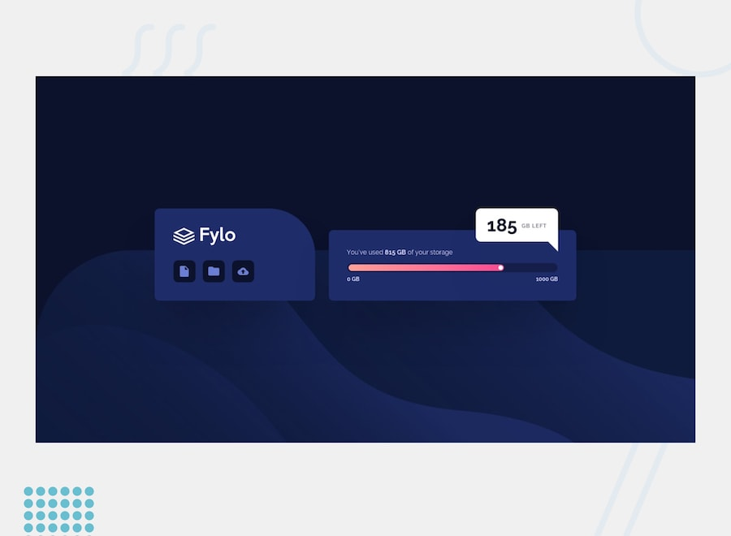

# Frontend Mentor - Fylo Data Storage Component

- [Frontend Mentor - Fylo Data Storage Component](#frontend-mentor---fylo-data-storage-component)
	- [Overview](#overview)
		- [Live Demo](#live-demo)
	- [Frontend Mentor](#frontend-mentor)
		- [The Challenge](#the-challenge)
	- [Built Using](#built-using)
	- [Author](#author)
	- [License](#license)

## Overview

I'm back to studying programming and I've started with the good old HTML and CSS. After finishing the course I'm tackling some [Frontend Mentor](https://www.frontendmentor.io) challenges to put into practice everything I've learned as I continue my studies.

### Live Demo

- [Live Demo](https://fuzz-lemon-drift.netlify.app)

## Frontend Mentor

[Frontend Mentor](https://www.frontendmentor.io) challenges help you improve your coding skills by building realistic projects.

The challenges are pretty straight forward, you have to replicate the page or element as closely as possible as the initial image or Figma layout - when provided.

### The Challenge

- [Fylo Data Storage Component](https://www.frontendmentor.io/challenges/fylo-data-storage-component-1dZPRbV5n)

Use any tools you like to help you complete the challenge. So if you've got something you'd like to practice, feel free to give it a go.

Your users should be able to:

- View the optimal layout for the section depending on their device's screen size

Want some support on the challenge? [Join the Frontend Mentor community](https://www.frontendmentor.io/community) and ask questions in the **#help** channel.

## Built Using

- HTML
- CSS
    - Flexbox
    - Grid

## Author

[@psudo-dev](https://github.com/psudo-dev)

## License

This project is licensed under the MIT License - see the [LICENSE.md](./LICENSE.md) file for details
